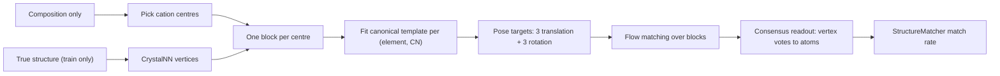

# Coarse-to-fine crystal generation, explained for a machine learning audience

This document explains what `cgfm/` builds, in machine learning terms, assuming no materials science.
It is meant to be readable straight through by someone who knows diffusion and flow matching and has never opened a crystallography textbook.
It ends with an honest scorecard, because two of the numbers this project reported for months were measuring the wrong thing and the corrected readings change what the results mean.

For the running state of the experiments see [PROJECT-STATE.MD](PROJECT-STATE.MD).
For the original Stage-1 partition experiment see [README.md](README.md).

## 1. The task, in one paragraph of ML

A crystal is an infinite structure described by a finite repeating unit.
The data for one crystal is a triple: a `3 x 3` matrix `L` whose rows are the three vectors that tile space (the **lattice**), a list of `N` atomic numbers, and `N` positions.
Positions are stored as **fractional coordinates** in `[0, 1)^3`, so a Cartesian position is `x @ L`.
Because the structure repeats, fractional coordinates live on a 3-torus: `0.99` and `0.01` are neighbours.
**Crystal structure prediction** is the conditional generation problem: given the multiset of atomic numbers only (the **composition**, for example two lithium, one iron, four oxygen), generate `L` and the `N` positions.
`N` is given, so this is generation in a fixed but per-example dimension.

Success is measured by **match rate**: the fraction of generated crystals that a symmetry-aware graph matcher (`pymatgen`'s `StructureMatcher` at `ltol=0.3, stol=0.5, angle_tol=10 deg`) declares equivalent to the held-out truth.
Equivalent means "the same crystal after any relabelling of identical atoms, any global translation, any rotation, and any change of the repeating unit".
Two benchmarks: **MP-20** (45k crystals, at most 20 atoms per cell) and **MPTS-52** (40k crystals, at most 52 atoms, split by discovery date so it is a genuine extrapolation).

The baseline is **OMatG**, a flow-matching model.
It treats each atom as a node in a fully connected graph, interpolates fractional coordinates linearly along the torus from a uniform prior, interpolates the lattice linearly from a data-informed prior, and regresses the conditional velocity.
Nothing about chemistry is built in.

## 2. Six terms you need

| term | what it means in ML terms |
| --- | --- |
| lattice / cell | the `3 x 3` matrix `L`; nine of the parameters to be generated |
| fractional coordinates | positions in `[0, 1)^3`, on a torus; Cartesian is `x @ L` |
| coordination number (CN) | the degree of an atom in a chemically-derived neighbour graph, here capped at 12 |
| coordination polyhedron / motif | an atom together with its neighbours: one node plus its neighbourhood, treated as a rigid unit |
| CrystalNN | a deterministic, non-learned rule that decides who an atom's neighbours are, given the true positions |
| match rate | the accuracy metric, invariant to relabelling, translation, rotation, and cell choice |

## 3. The hypothesis

Local neighbourhoods in crystals are not arbitrary.
A silicon atom surrounded by four oxygens is almost always a near-regular tetrahedron with a characteristic size, in every silicate ever measured.
So a crystal looks less like an arbitrary point cloud and more like a small number of near-rigid pieces packed together.
That suggests two things a generative model might exploit:

1. **Fewer degrees of freedom.**
   Instead of `3N` coordinates, generate `M` rigid-body poses, `3` translation and `3` rotation each, plus the `9` lattice parameters.
   If `M << N` this is a large compression.
2. **A coarse-to-fine ordering.**
   Place the pieces first, then their internal geometry, rather than resolving every atom at the same rate.

This is the same intuition behind protein backbone-frame models (FrameDiff, FrameFlow) and behind MOFFlow and MolCrystalFlow for metal-organic and molecular crystals, both of which beat atom-level baselines.
The difference, and the part with no published precedent, is that in those settings the rigid pieces are **disjoint and given**: a molecule is a molecule.
In inorganic crystals the pieces **share atoms** — one oxygen is typically a vertex of four or five different polyhedra at once — and which pieces share which atoms is part of what has to be generated.

Section 8 reports how each of these two claims actually fared.
The short version is that claim 1 is false as implemented and claim 2 was tested twice and failed twice, but a third thing nobody was looking for turned out to be worth a lot.

## 4. Preprocessing: building supervision targets

This entire section is **data preparation, not a model**.
It runs once, offline, and its only job is to convert each training crystal into a set of rigid-body poses that a network can regress.
It is the part most likely to be misunderstood as part of the architecture.

Entry point: `python -m cgfm.scripts.precompute_blocks`.
Code: [blocks.py](blocks.py), [blockdata.py](blockdata.py).

**Step 1. Choose which atoms are centres, from the composition alone.**
Every block is centred on one atom, so the number of blocks is the number of poses the model must emit — and at generation time only the composition is known.
The rule must therefore be a function of composition and nothing else.
It is a four-way cascade ([blocks.py](blocks.py) lines 873-882):

1. one distinct element: every atom is a centre;
2. otherwise try a charge-balanced assignment of oxidation states, and take the positively-charged elements;
3. otherwise call the most electronegative element the anion and the rest centres, but only if the electronegativity gap exceeds `0.4` (`MINIMUM_ELECTRONEGATIVITY_GAP`), which refuses to split alloys;
4. otherwise every atom is a centre.

The ML-relevant point: an earlier version chose centres by analysing the true structure, which is circular.
Making the rule honest cost almost nothing — the reconstruction ceiling on MP-20 moved from 98.80 to 98.73 per cent.

**Step 2. Find each centre's vertices with CrystalNN.**
This *does* read the true structure, and that is legitimate, because it only ever runs on a training crystal to build a target — exactly like computing an optical-flow label.
At most 12 vertices are kept, nearest first (`COORDINATION_CAP`).
Vertices that are themselves centres are excluded.
Blocks **overlap**: an atom is on average a vertex of 4.5 different blocks.

**Step 3. Assign each block a discrete type, and fit one canonical template per type.**
The type key is `(centre element, coordination number)` — for instance `("Si", 4)`.
This is a **learned vocabulary in the weak sense**: it is not hand-specified, it is whatever the training split contains, 905 types on MPTS-52.
For each type, all its instances (up to 200) are aligned to each other by generalised Procrustes, three rounds of Kabsch plus vertex correspondence, and averaged.
The result is one canonical `(n, 3)` point cloud per type.
Unseen types at test time fall back to the most common template of the same coordination number, then to a constructed regular polyhedron.

**Step 4. Turn each block instance into a pose.**
Translation is the centre's fractional coordinate.
Rotation is the `3 x 3` matrix that best aligns the canonical template to this instance's vertices, solved by Kabsch over vertex permutations (exhaustive up to `5040`, Hungarian-plus-Kabsch alternation above).

**A subtlety worth its own paragraph, because it came out of a failing unit test rather than the literature.**
An octahedron has 24 rotations that map it to itself, so "the rotation of this block" is not a point in `SO(3)`, it is a coset — a *set* of 24 equally correct answers.
Regressing towards an arbitrary representative injects noise the size of a whole rotation.
The fix is to store the block's symmetry group (its **stabiliser**, up to 60 elements) alongside one representative rotation, and at training time pick whichever group element is nearest the sampled base orientation ([block_si.py](block_si.py) lines 311-313).
This is the same problem as regressing a molecular pose with symmetric substituents, or a bounding-box angle modulo 90 degrees.

**Step 5. Write it out.**
One `.npz` per split, ragged-concatenated across structures, with per-block `frac_pos (B, 3)`, `rotations (B, 3, 3)`, `block_type (B,)`, `template_offsets (B, 12, 3)`, `stabilizer (B, 60, 3, 3)`, plus a `vote_atom (B, 12)` map recording which atom each template slot corresponds to.
Leakage safety is enforced structurally: templates are fitted on train only, the coordination vocabulary mask comes from train only, and a settings digest plus source file hashes must agree before a table will load.

## 5. Architecture

Code: [block_encoder.py](block_encoder.py), [block_si.py](block_si.py), [block_sampler.py](block_sampler.py), [block_lightning.py](block_lightning.py).

**The one-sentence version: the graph nodes are polyhedra instead of atoms, so the generative problem becomes `6M` pose parameters plus `9` lattice parameters instead of `3N` coordinates plus `9`, and a fixed non-learned decoder turns poses back into atoms.**

**Step 1. Nodes.**
One node per block, `M` per crystal (`M` is about 8.7 on MP-20 and 11.5 on MPTS-52, against `N` of 19.3 and 24.4).
Node input features are concatenated and projected to width 512:

- centre element embedding, `512`, from the composition, always known;
- coordination number embedding, `512`, over 13 classes plus a mask token;
- flattened rotation matrix through a `Linear(9, 512)`, optional via `use_rotation_input`;
- sinusoidal time embedding, `256`.

**Step 2. Trunk.**
`BlockCSPNet` is DiffCSP's CSPNet applied to blocks: fully connected within each crystal, 6 layers, hidden 512, SiLU, LayerNorm, residual.
Edge features are the two node states, the fractional separation `(x_j - x_i) mod 1` through a 128-frequency sinusoidal embedding, and the lattice Gram matrix `L @ L.T`, which is how translation-invariance and the lattice enter.

**Step 3. Four heads.**

| head | output | shape |
| --- | --- | --- |
| translation | conditional velocity of the block centre | `(M, 3)` |
| rotation | the **endpoint** orientation `R_1`, via 6D Gram-Schmidt | `(M, 3, 3)` |
| coordination | logits over 13 classes, invalid `(element, CN)` pairs masked to `-1e9` | `(M, 13)` |
| lattice | conditional velocity of the cell | `(1, 3, 3)` |

**Step 4. Probability paths.**
Four coupled fields, one shared forward pass:

- **translation**: linear interpolation on the torus from a uniform prior, with minimum-image unwrapping;
- **rotation**: `SO(3)` geodesic `R_t = R_0 exp(t log(R_0^T R_1))` from a uniform prior on `SO(3)`;
- **coordination**: discrete flow matching, mask-and-unmask, from an all-masked prior;
- **lattice**: linear interpolation from a data-informed prior.

**Step 5. Loss.**
Weighted sum of a flow-matching regression on translation and lattice, cross-entropy on coordination, and for rotation a **vertex-space** distance: apply `R_pred - R_target` to the template's offsets and take the mean squared displacement in Angstrom-squared.
Regressing the rotation in vertex space rather than on the manifold makes the loss scale with the physical error and makes near-degenerate blocks contribute little, which is correct — a block with two vertices has almost no orientation to get right.

The translation loss subtracts the **per-structure mean velocity**, so the model only ever learns positions up to a global translation.
That is the right thing to do, because the matcher is translation-invariant, and it is also the direct cause of the metric fault in section 8.

Optionally a **consensus** term: reconstruct the predicted endpoint, place every block's template vertices, average the disagreeing votes for each shared atom, and penalise the distance to the true atoms.
Residuals are measured in the *target* lattice; measuring them in the predicted lattice makes shrinking the cell a free way to lower the loss, which silently inflated and collapsed generated cells for a while.

**Step 6. Sampling.**
210 explicit Euler steps, one forward pass each, with a velocity scaling `(1 + factor * t)` inherited from OMatG's tuning.
Rotation is the interesting case: the head predicts an endpoint, so the body velocity is recovered analytically as `omega = log(R_t^T R_1) / (1 - t)` and applied as `R_{t+dt} = R_t exp(dt * omega)`.

**Step 7. Readout, a fixed decoder with no parameters.**
Blocks give poses; the metric needs atoms.
Each block places its template's vertices, giving several **votes** per atom because blocks overlap.
Votes are agglomeratively clustered (average linkage, periodic distances) into exactly as many clusters as the composition demands, each cluster's periodic mean becomes an atom, and elements are assigned to clusters by Hungarian matching so the composition comes out exactly right.
The readout uses the composition only as a multiset and never reads the target geometry; atoms it cannot reach are piled onto centres, which costs the match rather than borrowing the answer.

**Why overlap is the crucial design choice.**
An individual polyhedron sits 0.476 Angstrom from its type's canonical template on average, far too distorted to rebuild a crystal from any single one.
But 66 per cent of atoms are shared and each atom gets 4.5 votes, so averaging cancels most of the individual distortion and leaves 0.116 Angstrom.
The system is **over-determined**, and that redundancy is what makes rigid templates usable at all.
It is also why the earlier partition-based version could not work: a partition has to destroy the sharing, and the sharing was the signal.

## 6. How this differs from the atomwise baseline

Identical: the trunk architecture, the optimiser, the schedule, the lattice path, the matcher and its tolerances.
Different: nodes are blocks not atoms; two extra fields (rotation, coordination number); an extra non-learned decoder between the model output and the metric.

## 7. What the two earlier designs were, and why they failed

**Stage 1, a coarse-to-fine reparameterisation of the path.**
Partition the atoms into groups; let the group centroids move on a schedule that runs ahead of the within-group residuals.
Four arms on MP-20.
Every coarse-grained arm tied with or lost to atomwise, and the deficit grew with the strength of the effect.

Three reasons, all instructive:

1. **The bias never reached generation.**
   The schedule bump vanishes at `t = 0` and `t = 1`, so the modelled distribution is *identical* for every setting.
   This is a general fact about endpoint-preserving conditional path reparameterisations: they can change optimisation dynamics and sampling efficiency, not converged quality.
   Six of nine coarse-grained runs led at epoch 49 and every lead was gone by convergence, which is exactly that signature.
2. **A partition cannot hold a coordination environment**, because polyhedra share atoms and a partition must break the sharing.
   The groups came out at 2.75 atoms with a third singletons, so the arm was testing small geometric neighbourhoods rather than the hypothesis.
3. **The grouping network read the clean target**, which does not exist at sampling time.

**Rigid blocks with full `SE(3)` poses.**
Built, trained end to end on MPTS-52, and reached 1.2 per cent match against an atomwise baseline that has since finished at 26.8.
Depth was the only intervention that helped.
See the next section for what turned out to be wrong with the diagnosis, and section 10 for the third and last version of the underlying claim.

## 8. The honest scorecard

**Two metrics were measuring the wrong thing, and both had been shaping conclusions.**

*Rotation error* was a mean over blocks, a third of which have fewer than three vertices and therefore no orientation at all.
It sat at the random-orientation value while the match rate moved, and it does not predict the match rate.

*Translation error* was worse, and it was the number the central negative conclusion rested on.
It compared block `i` to labelled target `i` ([block_lightning.py](block_lightning.py) line 276 before the fix).
Two problems.
Same-element centres are interchangeable, so a crystal with eight lithium centres has `8!` equally correct labellings and the matcher accepts all of them.
And the training target is centred per structure, so the generated centroid stays wherever the uniform prior put it and the model has no way to move it.
A *perfect* generation therefore reads about `0.45 * V^(1/3)`, which on MPTS-52 is 3.4 Angstrom — precisely the value that "stayed pinned through every intervention".
It is now `centre_error`, which solves the assignment per element with `linear_sum_assignment` and quotients out one global translation; the old value survives as `translation_error_labelled`.
On a one-epoch run the two read 2.01 and 3.80 Angstrom, so the discarded gauge was worth 1.8 Angstrom of pure noise.

**Claim 1, fewer degrees of freedom: false as built.**
`6M + 9` against `3N + 9` is a ratio of 0.95 on MPTS-52.
Cells of 20 to 50 atoms simply do not have `M << N`.
MOFFlow's compression argument needs cells of hundreds of atoms.
Only the centres-only variant, `3M + 9`, is genuinely smaller, by a factor of about two.

**Claim 2, coarse-to-fine ordering: not supported, and there are two first-principles reasons.**
The appeal of coarse-to-fine is scale separation, and these datasets have almost none.
Measuring the usable spatial frequency range — from the fundamental `1/L` to the bond scale of about `1/2.2` inverse Angstrom — gives **1.51 octaves on MP-20 and 2.00 on MPTS-52**, against **8 octaves for a 256x256 image**.
A 20-atom cell is roughly one length scale wide, so there is no cascade to walk through.

The second reason is sharper, and it is the one to bring to an ML audience, because it says the ordering is not merely unavailable but *inverted*.
A natural image is "red": its variance concentrates at low frequency, which is exactly what makes resolving coarse before fine the natural order.
A crystal is **blue**.
Divide the structure factors by the atomic form factors and you get the normalised intensity `|E|^2`, which equals 1.0 in every shell if the atoms are placed independently, so it reads directly as how much structure there is relative to random.
On MPTS-52 the medians run `0.000, 0.000, 0.009, 0.074, 0.113, 0.340, 0.336` from the longest wavelength to the bond scale.
The coarse scales sit two orders of magnitude *below* random, for two structural reasons: a crystal is a dense nearly incompressible packing, so long-wavelength density fluctuations are the one thing it cannot have, and symmetry forbids a large share of the low-order reflections outright — 66 per cent of them are exactly zero in the coarsest shell.

The consequence, measured rather than argued: the coarsest band **never** leads in per-shell signal-to-noise, at any time, under OMatG's prior or a Gaussian one.
The lead sits at 3 to 6 Angstrom, the coordination-shell scale, and barely moves along the trajectory.
So a coarse-to-fine schedule spends its early capacity on the emptiest bands.
The study also found a separate, fixable defect: OMatG's uniform-torus prior makes the filter an exact product of three sincs, so whole families of reflections are annihilated at rational times — a `5.7e30` dead zone at `t = 0.5` against `1.1` for a Gaussian prior, which the Debye-Waller factor of a Gaussian prior would remove outright.
See [scripts/spectra.py](scripts/spectra.py) and [reports/spectra/summary.txt](reports/spectra/summary.txt).

**What the representation is actually worth, which nobody was looking for.**
Handing a trained model exact values for one degree of freedom at a time, on 150 unseen MPTS-52 crystals:

| given exactly | match rate |
| --- | --- |
| nothing | 0.0% |
| rotations | 0.7% |
| translations and cell | 72.0% |
| translations and cell, **rotations drawn from the prior** | **73.3%** |
| everything | 90.0% |

Against a floor of 22 per cent for correct centres with every other atom placed uniformly at random.
So the motif vocabulary is worth **51 points**, it needs **no orientation prediction at all**, and orientation — which carried almost all of the new machinery, half the loss weight, and nine numbers of prior noise per node — is not merely redundant but slightly harmful.
The accuracy it demands is not crystallographic, but it is not lenient either: centres to 0.3 Angstrom hold 73 per cent, which is what it takes to clear the finished 26.8 per cent baseline, and by 0.5 Angstrom the ceiling has already dropped below it.

**The intervention that followed, and what it did.**
Removing the rotation objective on the 100-structure memorisation gate, at 105000 optimiser steps:

| arm | best match |
| --- | --- |
| joint, the full apparatus | 7% |
| no rotation input only | 7% |
| **no rotation objective** | **62%** |
| both removed | **66%** |
| atomwise control, same task and budget | 79% |

A ninefold change, from the loss weight rather than the input.
The block model is in the same league as atomwise for the first time.
Note that `translation_error` was flat at 3.4 Angstrom across all four arms while the match rate moved by that factor of nine, which is the clearest possible demonstration that the metric was broken.

**Where this leaves the direction, now that the measurement has finished.**
The full-`SE(3)` pose parameterisation is dead: it buys no compression and its orientation head is worth nothing.
The centres-only variant was the remaining hope, and it was measured on the real task at 1200 epochs a side with coordination numbers predicted rather than supplied ([scripts/run_centres_mpts52.sh](scripts/run_centres_mpts52.sh)):

| arm | best match | last | centre error |
| --- | --- | --- | --- |
| atomwise | **26.82%** | 26.48% | — |
| centres-only blocks | 17.04% | 16.72% | 1.44 A |

Blocks lead at the first validation and lose from the second onwards, which is the shape of a representation that is easier to fit and has a lower ceiling, not one that starts slowly.
The block curve is flat for its last 600 epochs while atomwise is still gaining about 2 points per 200, so the gap at convergence is wider than the 9.8 points shown.
And the binding constraint is identified: centre error ends at 1.44 Angstrom where the tolerance curve above needs 0.3.

So the *parameterisation* is finished, and the vocabulary claim — the one part that has survived every test — is separated from it and retested on its own.
That is section 10.

**A caveat about an earlier comparison.**
The production run and the first version of that launcher loaded an overlay that copied each centre's *true* coordination number into the base state.
Coordination number is a property of the target structure, not of the composition, so that leaked a summary of the answer that the atomwise baseline never received and that no real inference could obtain.
The headline mode now predicts it; `blocks-oracle` keeps the old behaviour for the diagnostic question only.

## 9. Independent of all of the above: a conditioning interface

One argument for the block representation has nothing to do with match rate.
An atomwise model conditions on a composition and nothing else, so "generate a crystal with eight `GeS4` tetrahedra and three `PS4` tetrahedra" is not expressible as an input.
In a block model it is exactly a block-level composition, which is the native input.

That is the shape of the lithium superionic conductor question this project is ultimately aimed at, and it is worth noting that the target family is *more* favourable to the representation than MP-20 is: the interesting compounds have 50 to 70 atom cells, where `M << N` starts to hold, and their novelty lies in **condensed** frameworks where tetrahedra share corners — the overlapping-block feature that a partition destroys and this representation preserves.

Two pieces implement it.
[scripts/enumerate_thio.py](scripts/enumerate_thio.py) enumerates the composition family from `S = 4 (a + b) - c` and `Li = 4 a + 3 b - 2 c`, reproducing all five known compounds exactly.
And `centre_rule` `"framework"` in [blocks.py](blocks.py) gives every atom one of **three** roles instead of two, from the composition alone:

| role | who | parameters | placed by |
| --- | --- | --- | --- |
| pose | `Ge`, `Si`, `Sn`, `P`, `As`, `Sb` | 6 | its own translation and rotation |
| vertex | anything more electronegative than every former, so `S` here | 0 | consensus over the votes cast for it |
| free | everything else, lithium in particular | 3 | its own translation, no orientation |

The third role is new and it is the point.
The generic rule has only two, so it must call lithium a centre, and then a 66-atom cell becomes 32 blocks spending six numbers each to explain two atoms — 201 parameters against 207 atomwise, which is no compression at all.
Under the framework rule the same cell is 11 poses, 21 free atoms and the cell: **138 against 207**.
And it is the honest parameterisation as well as the cheaper one, because a superionic conductor is *defined* by its lithium not having a fixed coordination environment, so a rigid template fitted to it would be fitting a distribution as though it were a shape.

One subtlety worth flagging, since it looks like the leakage fault of section 8 and is not.
Under this rule the model may be *told* that a tetrahedron has four vertices.
That is admissible because "XS4" is a stipulation of the hypothesis being tested, fixed before any structure is looked at, whereas `cn_mode: oracle` copied a coordination number measured off the target.
The test is not whether the model receives a number, it is whether the number could have been written down from the composition and the rule alone.

## 10. The third version of the claim: motif tokens

Two designs have now failed, and it is worth being precise about what each of them actually tested, because they both bundled three claims together and only one of the three has ever been supported.

| claim | tested by | verdict |
| --- | --- | --- |
| resolve coarse scales before fine ones | Stage 1 partitions, and the spectral study | **no**, and the spectrum runs the wrong way |
| generate objects with poses instead of atoms | rigid blocks, then centres-only | **no**, 17.0 against 26.8 |
| local geometry lives on a small discrete set | the readout, given true poses | **yes**, worth 51 points |

The third claim has never been tested on its own, because both experiments that involved it also changed what the model generates.
So this time nothing about the generative problem changes at all.
Same atomwise interpolation, same prior, same trunk, same losses, same hyperparameters as the 26.8 per cent run.
The only difference is that each atom carries one extra piece of information: a discrete label naming the local environment it sits in.

**What a token is, for an ML reader.**
This is VQ-VAE-style discrete latents, except the codebook is fitted offline on a hand-built invariant descriptor rather than learned end to end, and the labels are attached to nodes rather than replacing them.
For each atom, take its neighbours within 6.0 Angstrom — the band the spectral study identified as where the signal actually is — and build a species-resolved power spectrum of that neighbourhood: six radial Gaussians under a cosine cutoff, real spherical harmonics to degree four, four "alchemical" species channels obtained by PCA of a standardised element-property table, giving about 1500 dimensions.
Whiten to 32 dimensions with PCA and fit a Gaussian mixture.
The mixture's responsibilities are the per-atom soft label.

The power spectrum is the standard trick for making a description of a neighbourhood exactly invariant to rotation: the coefficients `c[n,l,m]` rotate among themselves within each `l`, so summing `conj(c) c` over `m` gives a quantity that does not move.
Invariance to translation, atom reordering and choice of cell vectors comes for free from the construction, and all four are asserted in the tests rather than assumed, because the whole reason to hand-roll this instead of taking a dependency is that the invariances are checkable.

**Why the centre atom is excluded from its own descriptor.**
This is the one design decision that carries the idea.
`Si` in a tetrahedron of oxygens and `Ge` in the same tetrahedron get the *same* token, because the descriptor only sees the neighbours.
The token therefore names an environmental *role*, not a species, and one vocabulary of a few dozen entries can be shared across the whole periodic table instead of being split per element.
The element still reaches the model through the existing node embedding, so nothing is thrown away.
A measurable consequence: mutual information between token and element should be near zero, and if it is not, the descriptor is leaking the centre's identity and the shared vocabulary is not actually shared.

**Why the ceiling is measured before the mechanism.**
Both previous failures were diagnosed after a full apparatus had been built and trained to 1200 epochs, and both were answerable in a single arm by handing the model perfect values of the thing in question.
So the first real experiment hands the model the *true* token of every atom, computed from the target structure.
This is not a deployable model and its match rate is not a result: a token is a property of the answer, so supplying it gives away a summary of what the model is being asked to generate.
It is an upper bound.
If perfect tokens do not help, no scheme for predicting them can, and the eight-arm predicted-token experiment is not run at all.

**A short pilot has run, and the sign is positive but the size is small.**
One arm at an eighth of the budget, 200 epochs with oracle tokens at `K = 32`, reached 12.46 per cent against the atomwise run's 11.20 at the same epoch, so +1.26 points, having been +0.22 a hundred epochs earlier.
Two single validation passes differ by about a point from seeding alone, so the endpoint on its own is barely outside noise; what argues for it being an effect is that it grew with budget.
It is also well short of the 3 to 5 points the gate asks for.
The pilot's job was to show that the effect is not negative and that the input is genuinely reaching the trained model, which it did on both counts: the token embeddings settled at about a fifth of the element embedding's magnitude and stayed distinct from one another rather than collapsing to a single shared vector.

The bound is read against five controls, which is what makes it interpretable rather than just a number: the same architecture with handcrafted `(element, coordination number)` tokens, which the learned vocabulary must beat or it is not earning its complexity; the same tokens permuted among atoms of the same element, frequency matched, which must give *no* gain or the effect was extra capacity rather than information; and the vocabulary at a quarter and four times the chosen size, since a gain flat in `K` means the tokens act as a regulariser rather than as information.

**Two details that are lessons from the failures rather than new ideas.**
The auxiliary loss weight is not chosen by hand: it is set from the ratio of the two objectives' gradient norms on the shared trunk, so that the motif objective takes a measured 7 per cent of the trunk gradient, re-measured every 500 steps with a warning if it drifts.
The rigid-pose design gave its orientation objective half the loss weight by fiat and that turned out to be worth 0.7 match-rate points, and nobody could say afterwards whether the weight or the parameterisation was responsible.
And in the ceiling arm the motif *objective* is switched off while the motif *input* is switched on, because a head reading final features can trivially copy an oracle supplied at the input; keeping the two switches independent is exactly what made the rotation diagnosis possible.

Finally, a side effect worth having: `StochasticInterpolants.losses` was calling the model twice per step with identical inputs, once for positions and once for the cell.
Caching that halves the forward cost of every run in the repository, and it more than pays for self-conditioning's extra pass — 1.5 forwards per step against the 2 the baseline was spending.

## 11. The token had no geometry in it, and then the encoder could not read geometry either

The eight-arm experiment was never run, and the reason is a diagnostic that cost one GPU-hour and should have been run first.

**The null that won.**
Train two classifiers on the token.
They are the same architecture on the same budget; one sees the noised structure, the other sees coordinates and a cell drawn from the prior at *every* noise level, keeping only the element, the atom count and the time.
The second one is not a weak baseline, it is a model with no geometric information whatsoever.
They finished at 0.7916 and 0.7903 top-1.
**Zero geometry cost one tenth of an accuracy point.**

This is a trap specific to crystal-structure prediction and worth stating generally: the species are *given*, not generated.
The sampler mirrors them and the species loss is identically zero, so every atom's element and hence the structure's whole composition survive intact at every noise level.
A six-layer network with mean aggregation reads composition off a random graph exactly as easily as off a real one.
**Any per-atom quantity that correlates with composition will look predictable at every noise level, and absolute accuracy on such a target is uninterpretable.**
The only readable quantity is the gain over the geometry-free control, and reporting it is now mandatory for anything in this line of work.

**Why the token was predictable without geometry.**
Decomposing its 4.50 bits: neighbour composition 1.80, the atom's own element 1.48, bridging anion 0.61, coordination number 0.56, octahedrality 0.14, tetrahedrality 0.13.
The vocabulary was **three per cent shape and seventy-three per cent chemistry.**
Excluding the centre atom from its own descriptor, the design decision described above as the one carrying the idea, did keep the token from naming the centre's element — but the *neighbours'* elements walked straight in and did the same job.
A Gaussian mixture on a descriptor that contains both chemistry and geometry will partition on whichever is easier to separate, and chemistry is discrete and unambiguous while geometry is continuous and noisy.
The lesson generalises past this project: an unsupervised codebook is not evidence about the axis you intended it to discover, and the fix is to check the axis directly rather than to check that the codebook is well-formed.
Every diagnostic that was run — code utilisation, stability under displacement, posterior entropy, mutual information with coordination number — passed, because none of them asked how much *shape* the token contained.

**The replacement, and why it looked right.**
Drop the learned codebook for a label that is geometric by construction: `CrystalNN` for the neighbour set, then local order parameters over the polyhedron templates belonging to that coordination number only, argmax within it.
28 named classes like `tetrahedral CN_4` and `octahedral CN_6`, carrying 4.36 bits, nearly information-matched to the learned vocabulary's 4.50, with 0.4 per cent of atoms masked as unlabelled and none of them from an algorithm failure.
Displace a structure by 0.05 Angstrom and relabelling it recovers 96 per cent of the coordination numbers, so the information is there in the geometry and a deterministic reader gets it.

**And then the instrument check failed.**
Before spending anything on the new label, run the three arms on the easiest geometric target that exists — counting neighbours — using coordination-number tables that were already precomputed.
A classifier shown an *essentially clean* crystal, corrupted by about 0.01 Angstrom, reached 0.6389 against the geometry-free control's 0.6232.
**A gain of 1.6 points where the pre-registered gate asked for ten, on a label a deterministic algorithm reads at 96 per cent from a hundred times more corruption.**

It is not underfitting.
The same arm pushed its *training* cross-entropy to 0.083 nats, which is essentially memorising the training split, while validation cross-entropy climbed from 1.10 to 2.06.
It fits and does not generalise, and geometry demonstrably helps it fit — at a matched epoch it sat 0.25 nats below the geometry-free arm on training data — while buying almost nothing on held-out data.

**The suspect is what the encoder is handed.**
`CSPNet` builds a fully connected graph and gives each edge a 768-dimensional sinusoidal embedding of the **fractional** offset alongside the nine numbers of the lattice Gram matrix, then aggregates with `reduce='mean'`.
Two consequences, both of which point the same way:

- **Distance is never computed.**
  Getting it means learning `|dr|^2 = df^T (L L^T) df`, a bilinear form in two separately presented parts of the input, and learning it uniformly across every cell shape in the dataset.
  The raw `df` is not even available, only sines and cosines of it.
- **Mean aggregation is the wrong reduction for counting.**
  A coordination number is a *sum* of a soft distance indicator.
  A mean divides that sum by the atom count, and the atom count is not an input feature, so the model can only recover it by isolating the single self-edge whose share of the mean scales as one over it.

Composition, meanwhile, is exactly what a mean over species embeddings computes.
So the architecture makes the confound easy and the signal hard, which is a sufficient explanation for a network that reads chemistry off a random graph and cannot read geometry off a clean crystal.
Whether it is the *correct* explanation is a measurement, not an argument, and `cgfm/distance_encoder.py` makes it: append a radial-basis expansion of the true minimum-image Cartesian distance to every edge, zero-initialised so the model starts out identical, and change nothing else.

**The procedural point, which is the transferable one.**
Three designs have now failed, and all three were diagnosable at one to two per cent of the compute eventually spent on them, by a control that removes the thing under test rather than by a run that adds it.
Coarse-to-fine needed a spectrum, not a partition sweep.
Rigid poses needed an oracle-pose readout, not a 1200-epoch arm.
Motif tokens needed a geometry-free classifier, not six 1600-epoch arms.
In each case the cheap control was available from the beginning and the expensive experiment was the one that felt like progress.
